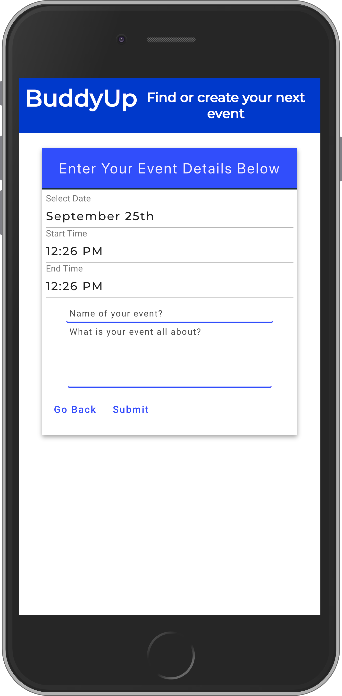
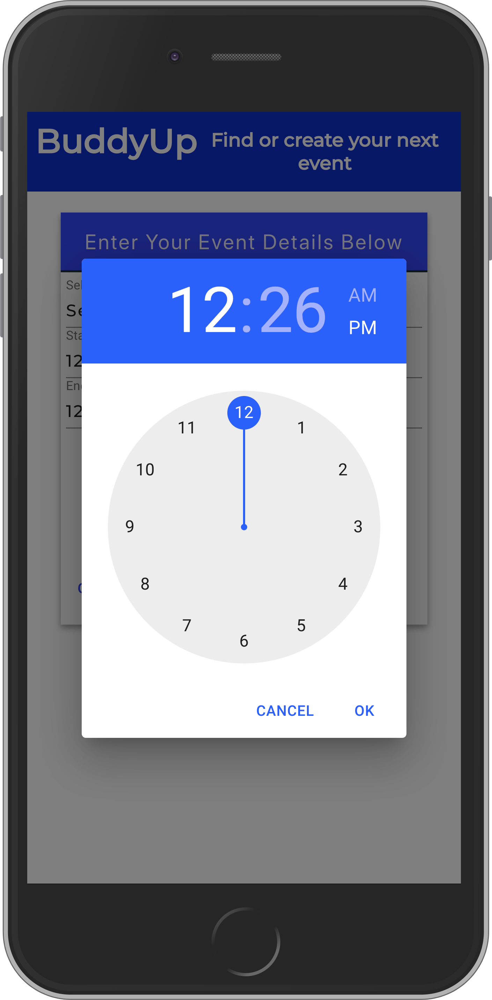
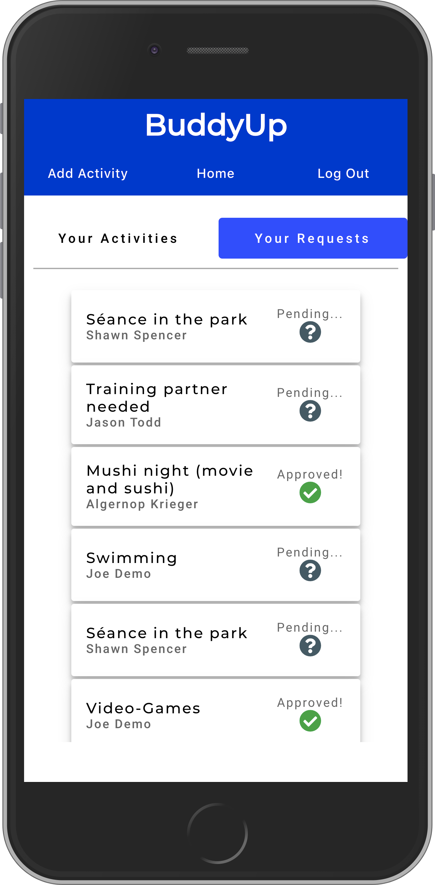

# BuddyUp Client!

BuddyUp is an application that allows you to organize and create activities in your area. Meet new friends while doing the activies you enjoy with BuddyUp!

## Demo User Info

-   username: demo@mail.com
-   password: DemoPass#1

## Landing Page

This is the initial view upon navigating to the app's home page.

## Registration

Here you can register with an email (which will be the user's username), password, name, and ZIP code (for displaying only local activities)

## Login

Here the user can log in

## Dashboard

This shows all activities in the user's area. This page can be navigated to from most pages by clicking "Home" in the navigation bar.

This is what it looks like when the user clicks an activity. Many additional details are displayed.

This is what it looks like when the user clicks "Sign up" on an activity. A contact method is requested so the activity creator and the user can communicate, as there is no messaging service in this app (yet).

## Activity Creation

This is the form for creating a new activity.

This is how the user chooses the time and date for the activity

## Account Overview

On the "Account" page, the user can see the activities and signup requests the user has made. This is the list of activities, which can be seen by clicking "Activities".

This is what it looks like when the user clicks an activity, showing additional details including who, if anybody, has signed up for the event. This view is how these signups are accepted, by clicking the toggle to the right of the user's name and contact information.

This is the list of signups, which can be seen by clicking "Requests"

This is what it looks like when an individual request is clicked in the link, showing the details of the event the user has signed up for.

## Authors

Matt Patterson, Camden Miller, Christopher Bogan, Kenneth Bice, & George Brown

## Technologies

-   Javascript
-   HTML 5
-   CSS 3
-   Node.js
-   React.js
-   JWT
-   Material UI
-   Date-IO
-   Chai
-   Mocha

## GIST:

https://gist.github.com%2FCamdenQ%2F2711c1e9243373e3017c4edcf86099af

## Client repo

https://github.com/thinkful-ei-panda/buddyup-client
https://github.com/thinkful-ei-panda/buddyup-client.git

## API repo

https://github.com/thinkful-ei-panda/buddyup-api
https://github.com/thinkful-ei-panda/buddyup-api.git

## Trello

https://trello.com/b/gnD5pmC0/buddyup

# BuddyUp API!

Migration command

-   UP (win) knex migrate:latest (mac) npx knex migrate:latest
-   DOWN (win) knex migrate:rollback (mac) npx knex migrate:rollback

Seed command (win) knex seed:run (mac) npx knex seed:run

## Demo User Info

-   username: demo@mail.com
-   password: DemoPass#1

## End Points

### /api/auth/login

POST method for logging in.

Requires username and password in request body.

Responds with auth token.

### /api/auth/refresh

POST method for refreshing auth token.

### /api/users

POST method for registering.

Requires username, name, password, and zip_code of new user in request body.

### /api/user/:id

GET method for fetching user by id

No body required.

Responds with name, username, zip_code, and date_registered of user with given id.

### /api/activities

Endpoint protected with Bearer token authentication.

GET method for fetching list of activities owned by user.

-   No body required.

-   Responds with array of all activities created by the user.

POST method for creating new activities.

-   Requires body with title string, description string, start_time string, and end_time string.

-   Responds with created activity object

### /api/activities/local

Endpoint protected with Bearer token authentication.

GET method to find activities in user's ZIP code.

-   No body required.

-   Responds with array of all activities with zip_code fields matching the user's zip_code information.

### /api/activities/:id

Endpoint protected with Bearer token authentication.

GET method to fetch single activity by activity id.

-   No body required.

-   Responds with activity with matching id.

PATCH method to update activity with given id.

-   Requires body with values to be updated.

-   Responds with updated activity values

### /api/signups

GET method to fetch list of signups.

-   Responds with list of all signups by created by the user by default.

-   Optional query: activity_id

-   If activity_id included as query, responds with all signups with matching activity_id column values, regardless of creator.

-   activity_id value must be present within "activities" table.

-   Activity must belong to the user.

### /api/signups/:id

PATCH method to update user-owned signup by id in path

-   Responds with no content

-   Body must include field to be updated. Presently only "contact_info" has any reason to be updated.

-   User actively prevented from editing "is_approved" field.

-   Signup must belong to the user

DELETE method to delete user-owned signups by id in path

-   No body required.

-   Signup must belong to the user

### /api/signups/approved

GET method to fetch list of signups for given activity which have been approved. Primarily for gathering activity attendees.

-   Requires body with valid activity_id.

-   Responds with list of all signups with given activity_id column value and "true" is_approved column value.

### /api/signups/approval/:id

PATCH method to toggle "is_approved" value of signup by id in path

-   Responds with no content

-   No body required

-   Boolean "is_approved" value of given signup is swapped to opposite value

-   User must own activity the signup is for

## GIST:

https://gist.github.com%2FCamdenQ%2F2711c1e9243373e3017c4edcf86099af

## Client repo

https://github.com/thinkful-ei-panda/buddyup-client
https://github.com/thinkful-ei-panda/buddyup-client.git

## API repo

https://github.com/thinkful-ei-panda/buddyup-api
https://github.com/thinkful-ei-panda/buddyup-api.git

## Trello

https://trello.com/b/gnD5pmC0/buddyup

## Authors

Camden Miller, Kenneth Bice, Matt Patterson, Christopher Bogan, & George Brown

## Technologies

-   Javascript
-   Express.js
-   Knex.js
-   PosgreSQL
-   Bcrypt.js
-   CORS
-   JWT
-   Postgrator
-   XSS
-   Chai
-   Mocha
-   NodeMon
